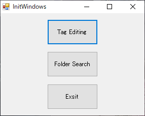
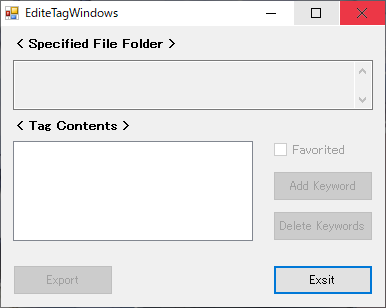
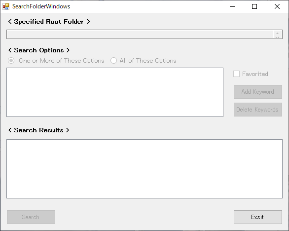

# file_folder_manager

***file_filder_manager*** is a tool to search file folders.
The tool exports a tag.json file that consistes of keywords and favorite information to directly under the specified file folder.
We can import tag.json files and search for file folders that meet the conditions.

## Tool Windows

### InitWindows
- Initial screen for transitioning to EditeTagWindows or SearchFolderWindows.

### EditeTagWindows
1. Drag and drop a file folder where you want to add or edit a tag.json file.
2. Set tag contents (keywords and favorited).
3. Click the "Export" button to save a tag.json file.

### SearchFolderWindows
1. Drag and drop a root folder to search folders.
2. Set search options (keywords and favorited).
3. Click the "Search" button.
4. Access the file folder in Explorer by double-clicking the folder path that is search results.

